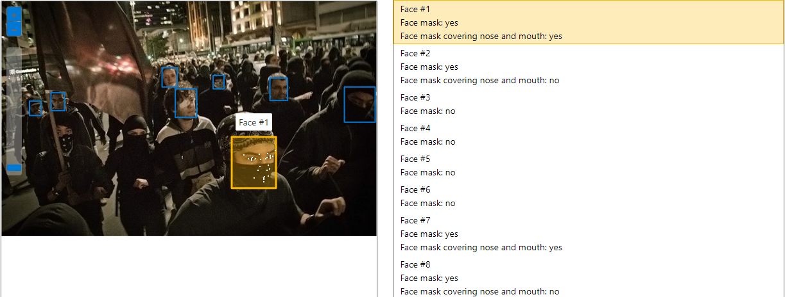
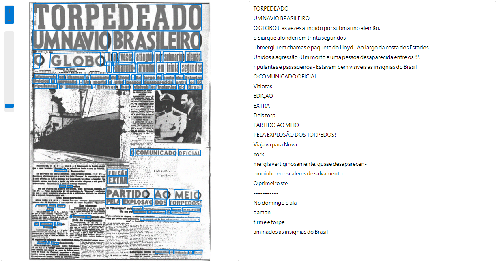

  
  <h1>Relatorio_AzureIA-Visao-Computacional</h1>
  

  
  

  
  
  

 

## Reconhecimento de faces em imagens:

### Opção do recurso no Vision Azure:

### Protesto com diversos black blocs:

#### Testando IA...

## Reconhecimento de texto em imagens:

### Opção do recurso no Vision Azure:

### Jornal "O Globo" da 2° guerra mundial:

#### Testando IA...

> # Todas as imagens são de domínio público!
> ### As imagens foram retiradas da internet, porém as mesmas já estão em domínio público.
